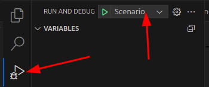

# Getting Started with QA Living Apps 2.0

## Index
1. [Base configuration](./docs/base-configuration.md#base-configuration)
2. [Run Local Tests](#run-local-tests)
3. [CIs configuration](./docs/cis-configuration.md#cis)
4. [Run CIs tests](#run-cis-tests)
5. [Check Results in Jira](#check-results-in-jira)
6. [Generate Release Report](#generate-release-report)
7. [QA Commons](https://github.com/Telefonica/living-apps-qa-common)
8. [Reports](./docs/reports.md)

## Run Local Tests
### Set local-toolium options:
#### Set if the execution is headless or not.
 ```
 [Driver]
 headless: false
 ```
#### Run inside local chrome or selenoid chrome _(Selenoid must be up: **make local-env**)_
 ```
 [Server]
 enabled: false
 ```
#### Save images (Only save images inside selenoid with headless mode):
```
[VisualTests]
save: true
```
#### Upload results to jira
```
[Jira]
enabled: true

[JiraExecution]
version: v3.26_Zorita
Build: Release
labels: ft,regression
Language: es
```
   
### Choose the runner:

* Scenario: Run selected Scenario name.
* Feature: Run open Feature.
* Tags: Run any selected tag. Jira ids, could run both ways @jira.QALAGLOB-123 or QALAGLOB-123
* Folders: Update launch file, to include expected path or run all folders. <br>
  ```
  Replace with expected feature path:
  ${workspaceFolder}/tests/acceptance/features/
  ```
* Python script: Open expected script.<br>
  **Include expected args in launch file**
* LAQACommons - script: Include qa commons tool name and expected args
  ```
  "args": [
    "jira-queries"
  ],
  ```

**Press F5 in keyboard to RUN the launcher**

## Run CIs tests
Navigates to proyect actions: https://github.com/Telefonica/{repository-name}/actions/workflows/qa-acceptance-tests.yaml <br>
Select `QA Run Acceptance Tests` workflow <br>
Inputs:
* _Select the environment_<br> 

  >Choose between configured environments. <br>
  >Examples: es-qa, es-dev, br-qa, ... 

* _Select priority_
  >Choose tests prioriy. <br>
  >Options: <br>
  >1. `Regression`. Execute all test. Only if issue is not selected, then only issue tests are being executed.
  >2. `Smoke`. Execute smoke test. If issue include execute both, smoke and issue tests
  >3. `Sanity`. Execute sanity test. If issue include execute both, sanity and issue tests

* _Scenario tags_ 
  >Tags separator(**,** is **or** condition, **;** is **and** condition)

* _JIRA Isssue._
  > Jira issue id. Example: LIVINGAPPS-1234

* _Jira Version_
  > Jira Version: [Jira QA Expected Version](https://jira.tid.es/plugins/servlet/project-config/QALAGLOB/administer-versions?status=unreleased)<br>
  > This includes version in tests url.

* _Jira Build_
  > Jira Build. Release, final, rc1, rc2, rc3, ...

* _filter-folders_
  > Project folders list, to execute parallel or in different folders

* _Max parallel tests_
  > Only 4 runners are available. For long runs limit runners number.

* _Demo URL_
  > The Living App is not already in master. Use any url.

## Check Results in Jira

### Search in Jira website
[Jira Search](https://jira.tid.es/browse/QALAGLOB-727741?jql=project%20%3D%20QALAGLOB%20ORDER%20BY%20created%20DESC)<br>
Query Example:
```
project = QALAGLOB AND issuetype="Scenario" and (issueFunction not in parentsOf("labels = final and \"Executed Version\" = v3.25_Yanguas and build = rc2")) and component = Generic and labels not in ('future', 'skip', 'manual') and status = Active and "Execution Mode" != manual
```

### Search using laqacommons
Check Failed results. (Include in make file as **make regression-failed**)

```bash
cd tests/acceptance
laqacommons jira-queries -qt failed -v $${JIRA_VERSION} -c ${component} -p regression -b Release
```

Check Not executed tests. (Include in make file as **make regression-not-executed**)
```bash
cd tests/acceptance
laqacommons jira-queries -qt not_executed -v $${JIRA_VERSION} -c ${component} -p regression -b Release
```

## Generate Release Report
[QA Reporter](http://qacdco.hi.inet/qacdco-reporter) # VPN Required <br>
**Test Executions -> Click Generate**

### Mandatory Values in _QA Jira Project (executions)_:
* QA Project - Name: **QACDCO LA Global  (QALAGLOB)**
* Version
* Builds
### Mandatory Values in _Execution Groups (optional)_
* QA Components
### Mandatory Values in _Team Jira Project (issues)_
* Product Project - Name (key): **Living Apps (LIVINGAPPS)**
* Product Versions
* Components

**Click Generate**


↩️ **[Go Back to Readme](../../README.md)**