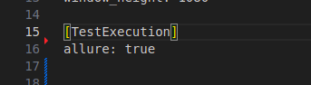

# Base configuration:

   1. Required Python version 3.11
   
   2. Import vscode Profile.
      Settings -> Profile -> Profiles -> New Profile (More Actions) -> Import Profile
      Get Profile from proyect -> [Profile.json](./utils/Projects.code-profile)

   3. Configure launch file .vscode/launch.json.
      Download the [launch.json](./utils/launch.json) file and place it in the `.vscode` directory.

   4. Decrypt project:
      https://confluence.tid.es/pages/viewpage.action?spaceKey=CTO&title=%5BLA-QA%5D+Tools

      Unlock repository:
         ```bash
            git-crypt unlock ~/carpeta/key.key
         ```

      Configure git-crypt in project: [Configure Git-Crypt](./configure-git-crypt.md#git-crypt)

   5. Virtual env (Root project)
      ```bash
         python3.11 -m venv .venv
         source .venv/bin/activate
      ```
      Configure env in vscode:
         Ctrl+P -> Python: Select Interpreter
         

   6. Install requirements inside the venv
      ```bash
         cd tests/acceptance/
         pip install -r requirements.txt
      ```
   7. Include local-toolium.cfg in tests/acceptance
      ```
         [Jira]
         enabled: true
         # reportAfter: scenario
         token: 

         [Driver]
         type: chrome
         chrome_driver_path: /usr/local/share/chromedriver
         headless: true

         [ChromeArguments]
         # mute-audio: false

         [TestExecution]
         environment: es-dev
         language: es-es
         auto_retry: true
         mock_mode: local
         env_file_path: .env.local
         user_test: user_ci_0
         # la_version: 3.25.0-yanguas
         # pr_number: 468
         # demo_url: https://globalmakermedia.blob.core.windows.net/web-pocs/PRs/la-generic-470/build/index.html

         [Server]
         enabled: true
         host: localhost
         port: 4444

         [VisualTests]
         save: false

         [JiraExecution]
         version: v3.25_Yanguas
         Build: Release
         labels: ft,regression

         [BrowserMobProxy]
         enabled: false
      ```

# Reports

## Allure
   ### Install
   [Allure](https://docs.qameta.io/allure/#_installing_a_commandline)
   
   ### Configure in project
   