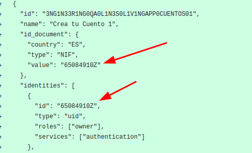
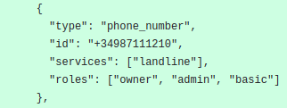
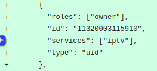
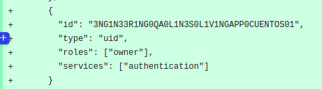

# Create Lines

Include lines in [Users.json](https://github.com/Telefonica/baikal-global-mocks/blob/master/api/provision/tenants/globalint/users.json) 
**All the ids must be unique**

## Id used to reserve line.
The IDs of ES users must consist of a string of numbers and uppercase letters with 40 characters.  

## Id_document -> value 

It must have the DNI or NIE characteristics but must be unique.  

## Identities -> phone_number                            

Include expected roles, basic ones - owner, admin, basic. 

## IPTV service

## Authentication
Same as `Id used to reserve line`

 

 
## [Example](https://github.com/Telefonica/baikal-global-mocks/pull/1679/files)

 
**[Go Back to QA Readme](../README.md)**