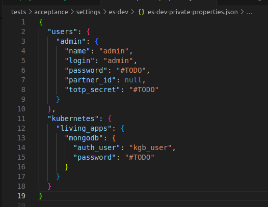
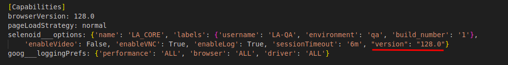
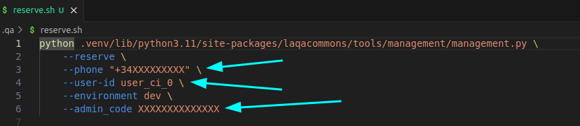
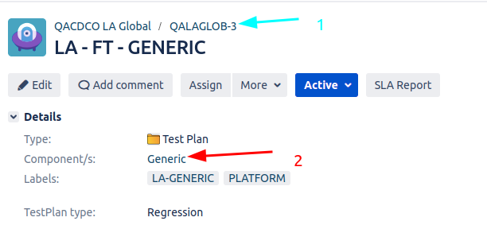
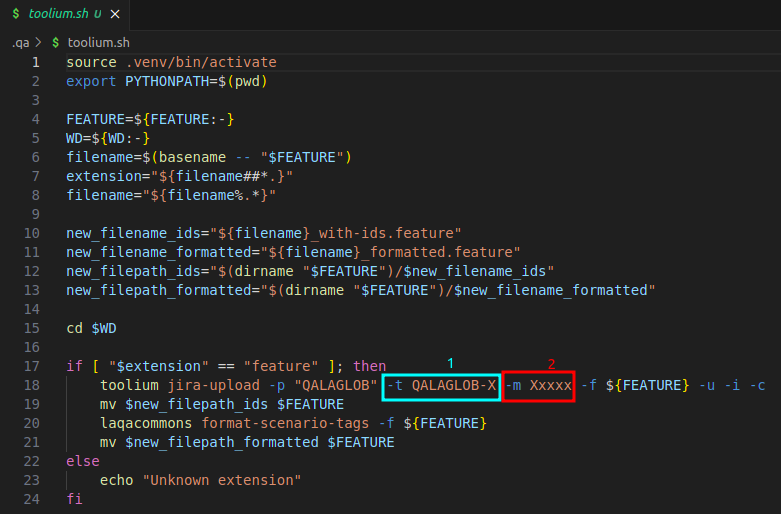

# Project First Day:

This is only required when is first project day, if is YOUR first day in project only check Base configuration.

1. [Base configuration](./base-configuration.md#base-configuration)
   
2. [Configure Git-Crypt](./configure-git-crypt.md#git-crypt)
   Upload created key to https://confluence.tid.es/pages/viewpage.action?spaceKey=CTO&title=%5BLA-QA%5D+Tools
   Base64 project key, Must be included in GH Actions secrets (Admin credentials required)

3. Set settings credentials for required enviroments: (Ask QA Team)
   

4. Create .env.local and set expected credentials (Ask QA Team)
   Export creadentials:
   ```bash
      export $(cat .env.local | xargs)
   ```

5. Update `laqacommons` version in requirements to the latest

6. Update in settings/toolium.cfg the following values:
   ```
   [Jira]
   token: {QAUser token}

   [TestExecution]
   matricula: ID0XXXX

   [Capabilities]
   browserVersion: 128.0
   ```
   

7. Configure Project lines:
   https://github.com/Telefonica/baikal-global-mocks/blob/master/api/provision/tenants/globalint/users.json

   Include Project lines in: [SDF Mock File](../settings/common-sdf-mock.json)

   TODO: Where the lines came from, if there are not in the user.json?
    
8. Include base settings in .qa folder
   1. Reserve lines:
      
   2. Upload Feature:
      Search in Jira "project = QALAGLOB and issuetype = 'Test Plan' and labels not in (uat)"
      
      
      1: Test Plan Number.
      2: Project Component.

9. Update Living App data in settings: 
   [Settings](../settings/common-living-apps.json)
   [Environment](../common/environment.py)
   Replace todo-app with la name in both files
